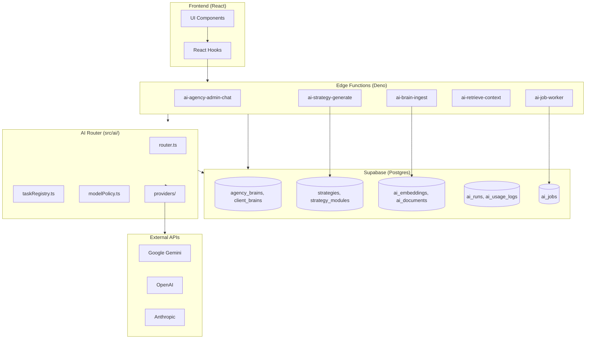
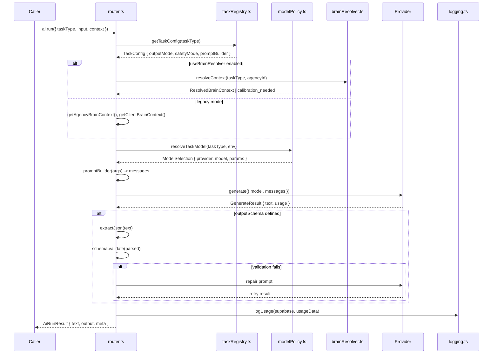
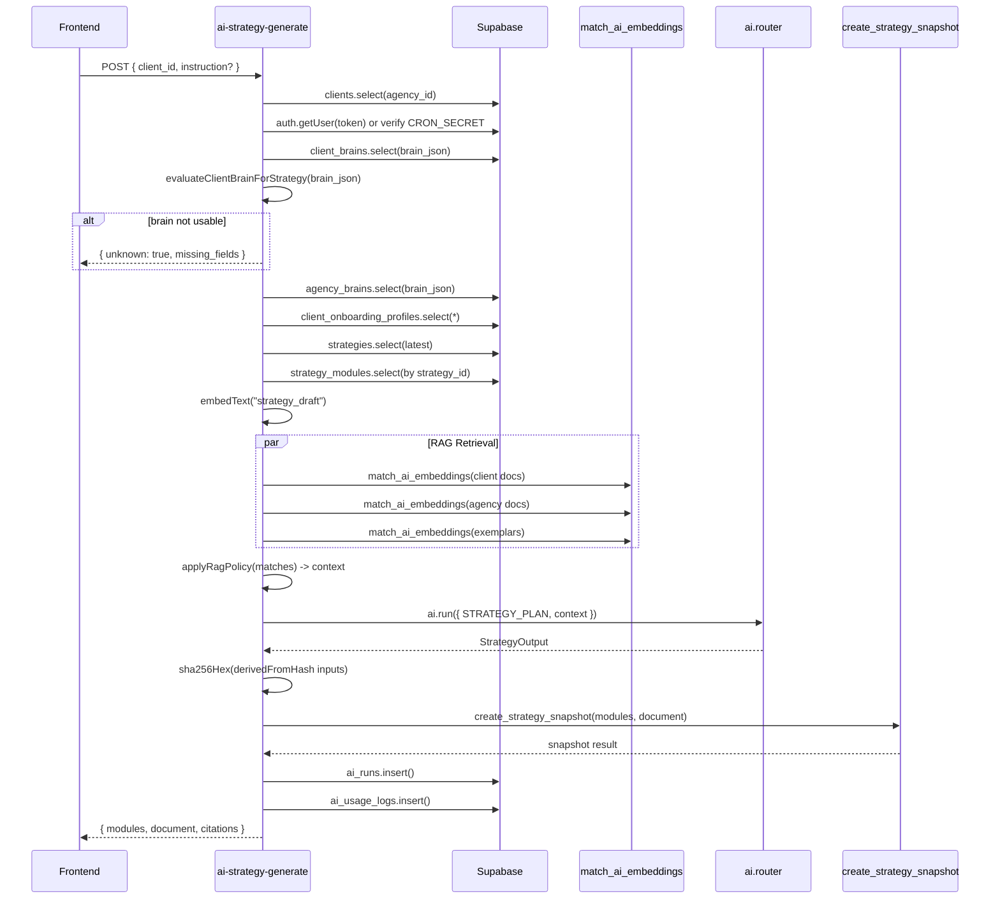
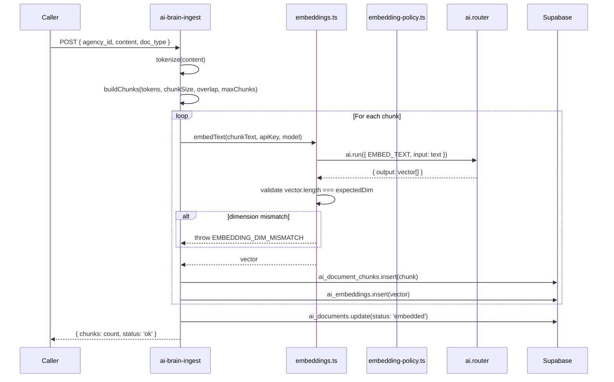
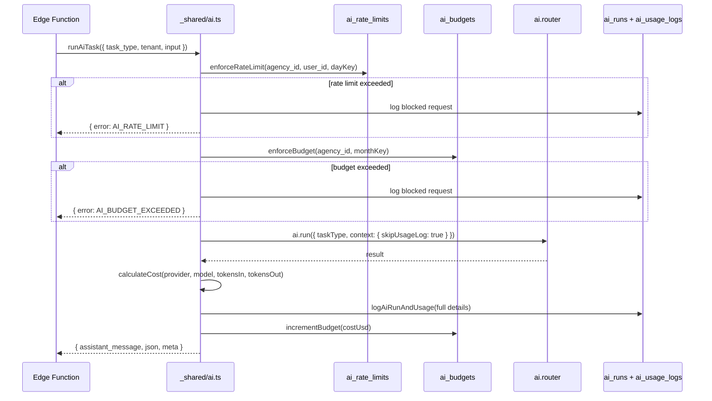
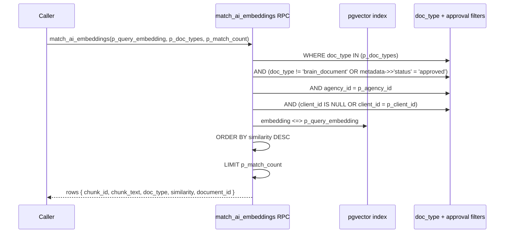
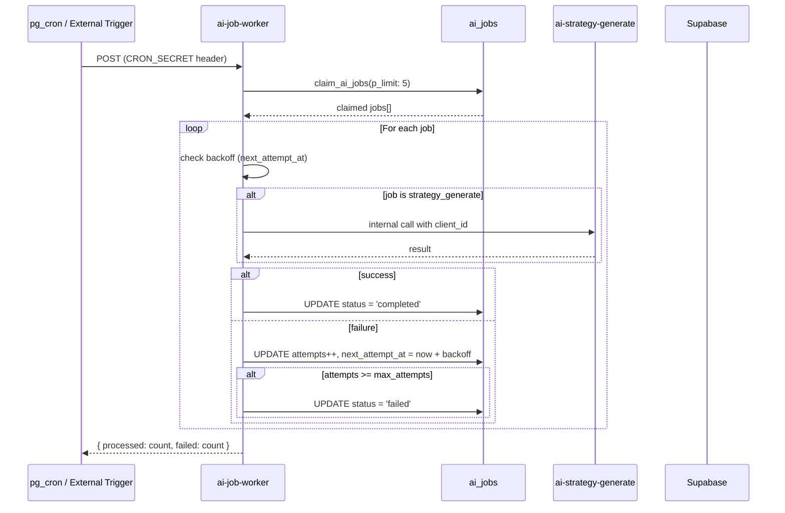
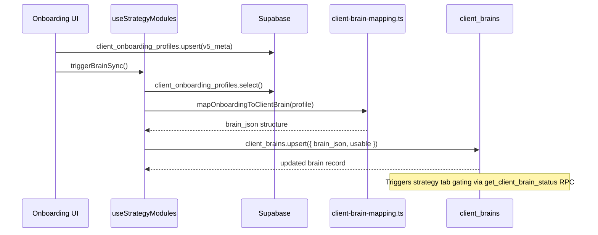
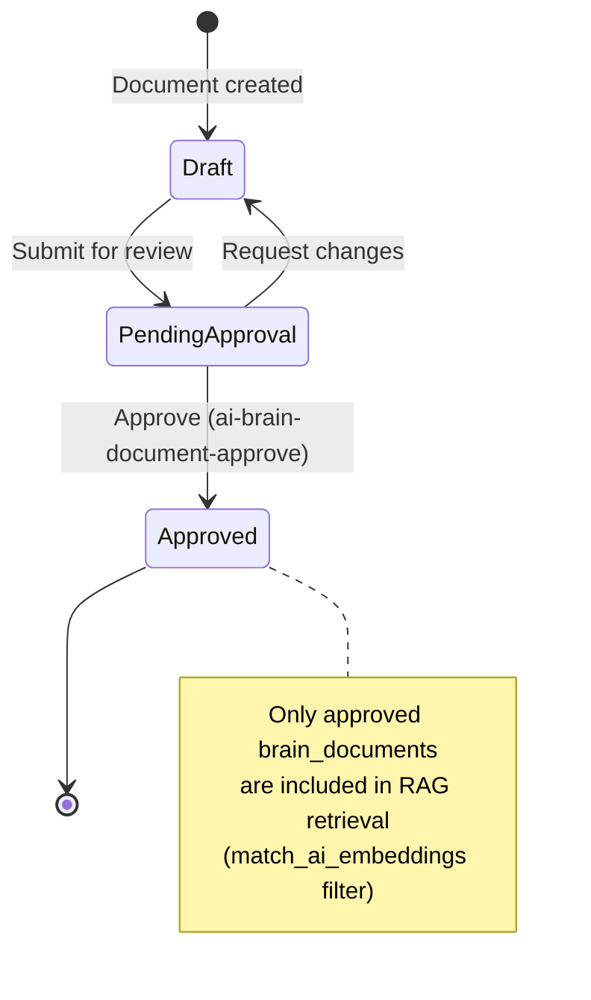
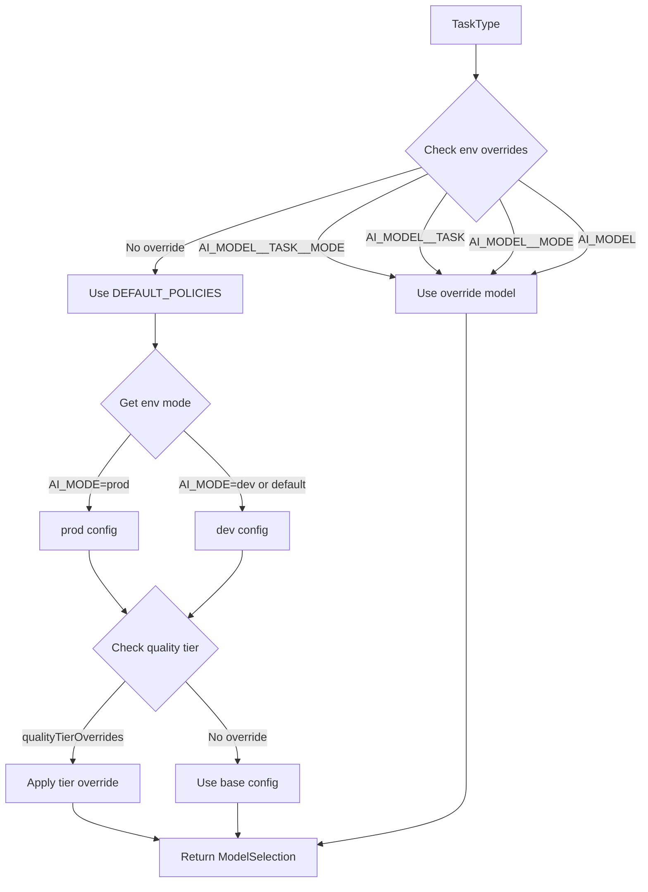

# AI Foundation Callgraphs

## Audit Date: 2026-01-10

---

## 1. Overall Architecture

---

## 2. AI Router Flow

**Source:** [router.ts:190-374](src/ai/router.ts#L190-L374)

---

## 3. Strategy Generation Flow

**Source:** [ai-strategy-generate/index.ts:87-609](supabase/functions/ai-strategy-generate/index.ts#L87-L609)

---

## 4. Embedding Pipeline

**Source:** [embeddings.ts:45-66](supabase/functions/_shared/embeddings.ts#L45-L66), [ai-brain-ingest/index.ts](supabase/functions/ai-brain-ingest/index.ts)

---

## 5. Edge Function AI Wrapper Flow

**Source:** [_shared/ai.ts:212-345](supabase/functions/_shared/ai.ts#L212-L345)

---

## 6. RAG Retrieval Flow

**Source:** [20260108134500_match_ai_embeddings_filters.sql](supabase/migrations/20260108134500_match_ai_embeddings_filters.sql)

---

## 7. Job Worker Flow

**Source:** [ai-job-worker/index.ts](supabase/functions/ai-job-worker/index.ts), [20260108152000_ai_jobs_queue.sql](supabase/migrations/20260108152000_ai_jobs_queue.sql)

---

## 8. Client Brain Mapping Flow

**Source:** [_shared/client-brain-mapping.ts](supabase/functions/_shared/client-brain-mapping.ts)

---

## 9. Brain Document Approval Flow

**Source:** [ai-brain-document-approve/index.ts](supabase/functions/ai-brain-document-approve/index.ts), [20260108134500_match_ai_embeddings_filters.sql](supabase/migrations/20260108134500_match_ai_embeddings_filters.sql)

---

## 10. Model Policy Resolution

**Source:** [modelPolicy.ts:166-201](src/ai/modelPolicy.ts#L166-L201)
