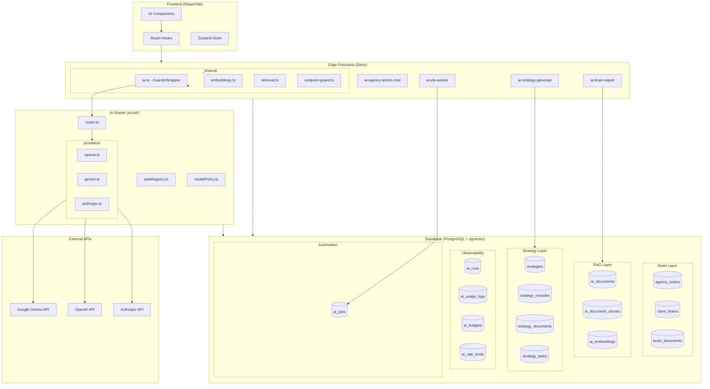
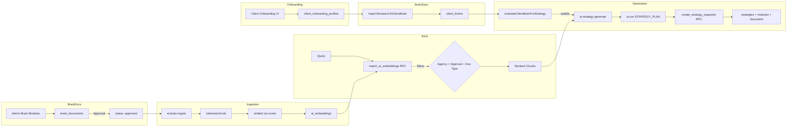

# AI Foundation Final Audit

## Audit Date: 2026-01-10
## Auditor: Claude Opus 4.5 (Staff+ Engineer)
## Commit: 233a343208d02f8cc42061e24d6cd3cc08f8eeb4

---

## 1. System Overview Diagram

---

## 2. Data Flow

---

## 3. Verified Invariants Checklist

| # | Invariant | Status | Evidence |
|---|-----------|--------|----------|
| 1 | All LLM calls go through router | **PASS** | [edge-llm-bypass.test.ts](tests/guards/edge-llm-bypass.test.ts) |
| 2 | Provider SDKs only in src/ai/providers | **PASS** | Bypass guard test |
| 3 | No direct provider URLs in edge functions | **PASS** | Manual grep verification |
| 4 | No zero vectors written | **PASS** | [embedding-store.ts:22-24](supabase/functions/_shared/embedding-store.ts#L22-L24) |
| 5 | Dimension mismatch throws error | **PASS** | [embeddings.ts:59-64](supabase/functions/_shared/embeddings.ts#L59-L64) |
| 6 | Failed embeddings marked, not stored | **PASS** | embedding_status flow |
| 7 | Brain documents require approval for RAG | **PASS** | [SQL filter line 50](supabase/migrations/20260108134500_match_ai_embeddings_filters.sql#L50) |
| 8 | Match count capped at 12 | **PASS** | [retrieval.ts:1](supabase/functions/_shared/retrieval.ts#L1) |
| 9 | Token budget enforced in RAG | **PASS** | [ragPolicy.ts:105-112](src/ai/ragPolicy.ts#L105-L112) |
| 10 | Strategy writes are atomic | **PASS** | [create_strategy_snapshot RPC](supabase/migrations/20260108143000_strategy_snapshot_rpc.sql) |
| 11 | Freshness hash computed from inputs | **PASS** | [ai-strategy-generate:437-447](supabase/functions/ai-strategy-generate/index.ts#L437-L447) |
| 12 | Rate limits enforced before AI calls | **PASS** | [_shared/ai.ts:229](supabase/functions/_shared/ai.ts#L229) |
| 13 | Budget enforced before AI calls | **PASS** | [_shared/ai.ts:251](supabase/functions/_shared/ai.ts#L251) |
| 14 | RLS enabled on all AI tables | **PASS** | Migration inspection |
| 15 | API keys server-side only | **PASS** | Edge secrets |
| 16 | No prompts/responses logged | **PASS** | ai.ts inspection |
| 17 | Jobs use optimistic locking | **PASS** | FOR UPDATE SKIP LOCKED |
| 18 | Jobs deduplicated at insert | **PASS** | Unique index + ON CONFLICT |

---

## 4. Top Risks

| # | Risk | Severity | Likelihood | Effort | Description | Recommended Action |
|---|------|----------|------------|--------|-------------|-------------------|
| 1 | **Stuck running jobs** | 6 | 5 | 2 | Jobs stuck in "running" if worker crashes | Add stale job cleanup cron |
| 2 | **Unmapped onboarding fields** | 4 | 7 | 3 | `budget`, `frequency` not in brain_json | Document or add mappings |
| 3 | **Quarantined endpoints unclear** | 3 | 6 | 2 | 5 endpoints disabled, no deprecation plan | Document intent + cleanup timeline |
| 4 | **Single worker bottleneck** | 4 | 4 | 5 | All jobs processed by one worker | Add horizontal scaling if needed |
| 5 | **No budget threshold alerts** | 5 | 6 | 3 | Users hit hard stop without warning | Add 80%/90% threshold notifications |
| 6 | **Schema repair without logging** | 3 | 4 | 2 | JSON repair attempts not auditable | Add repair attempt logging |
| 7 | **Citation validation soft** | 4 | 3 | 4 | Citation errors only block if AI_SCHEMA_STRICT | Decide on enforcement policy |
| 8 | **Large chunk sizes** | 3 | 5 | 4 | Build warning: 2.9MB bundle | Implement code splitting |
| 9 | **Missing brain fallback UX** | 4 | 5 | 3 | UNKNOWN responses may confuse users | Improve UI guidance on missing data |
| 10 | **Dimension change migration** | 5 | 2 | 7 | Changing from 1536 requires full re-embed | Use migration plan when needed |

### Risk Matrix Legend

- **Severity:** 1 (minor) to 10 (critical)
- **Likelihood:** 1 (rare) to 10 (certain)
- **Effort:** 1 (trivial) to 10 (months of work)

---

## 5. Verification Summary

### Tests Executed

| Command | Exit Code | Summary |
|---------|-----------|---------|
| `npm run test` | 0 | 379 tests passed |
| `npx tsc --noEmit` | 0 | No type errors |
| `npm run lint` | 0 | No lint errors |
| `npm run build` | 0 | Build succeeded |
| Bypass guard test | 0 | 2 tests passed |

### Coverage by Subsystem

| Subsystem | Tests | Integration Tests |
|-----------|-------|-------------------|
| Router | 5 | - |
| Model Policy | 6 | - |
| Task Registry | 1 | - |
| Embeddings | 3 | 5 |
| RAG | 1 | 3 |
| Budget | 1 | 3 |
| Bypass Guards | 2 | - |
| Tool Executor | 60 | - |
| Strategy Output | varies | - |

---

## 6. Audit Deliverables

| Document | Status | Path |
|----------|--------|------|
| AI_FOUNDATION_SNAPSHOT.md | Created | [docs/audit/AI_FOUNDATION_SNAPSHOT.md](docs/audit/AI_FOUNDATION_SNAPSHOT.md) |
| AI_FOUNDATION_VERIFICATION.md | Created | [docs/audit/AI_FOUNDATION_VERIFICATION.md](docs/audit/AI_FOUNDATION_VERIFICATION.md) |
| AI_INVENTORY.md | Created | [docs/audit/AI_INVENTORY.md](docs/audit/AI_INVENTORY.md) |
| AI_CALLGRAPHS.md | Created | [docs/audit/AI_CALLGRAPHS.md](docs/audit/AI_CALLGRAPHS.md) |
| STRATEGY_OS_INVENTORY.md | Created | [docs/audit/STRATEGY_OS_INVENTORY.md](docs/audit/STRATEGY_OS_INVENTORY.md) |
| AI_ROUTER_AND_PROVIDERS.md | Created | [docs/audit/AI_ROUTER_AND_PROVIDERS.md](docs/audit/AI_ROUTER_AND_PROVIDERS.md) |
| EMBEDDINGS_AND_DIMENSION_SAFETY.md | Created | [docs/audit/EMBEDDINGS_AND_DIMENSION_SAFETY.md](docs/audit/EMBEDDINGS_AND_DIMENSION_SAFETY.md) |
| RAG_PIPELINE_END_TO_END.md | Created | [docs/audit/RAG_PIPELINE_END_TO_END.md](docs/audit/RAG_PIPELINE_END_TO_END.md) |
| CLIENT_ONBOARDING_AND_CLIENT_BRAIN.md | Created | [docs/audit/CLIENT_ONBOARDING_AND_CLIENT_BRAIN.md](docs/audit/CLIENT_ONBOARDING_AND_CLIENT_BRAIN.md) |
| STRATEGY_BUILDER_END_TO_END.md | Created | [docs/audit/STRATEGY_BUILDER_END_TO_END.md](docs/audit/STRATEGY_BUILDER_END_TO_END.md) |
| AI_JOBS_AND_AUTOMATION.md | Created | [docs/audit/AI_JOBS_AND_AUTOMATION.md](docs/audit/AI_JOBS_AND_AUTOMATION.md) |
| AI_SECURITY_AND_GOVERNANCE.md | Created | [docs/audit/AI_SECURITY_AND_GOVERNANCE.md](docs/audit/AI_SECURITY_AND_GOVERNANCE.md) |
| AI_FOUNDATION_FINAL_AUDIT.md | Created | [docs/audit/AI_FOUNDATION_FINAL_AUDIT.md](docs/audit/AI_FOUNDATION_FINAL_AUDIT.md) |

---

## 7. Prioritized Fix Plan

### Priority 1: Critical (Immediate)

| Item | Effort | Description |
|------|--------|-------------|
| **None** | - | No critical issues found |

### Priority 2: High (Next Sprint)

| Item | Effort | Description |
|------|--------|-------------|
| Stale job cleanup | 2 | Add cron to reset stuck "running" jobs after 30min |
| Budget threshold alerts | 3 | Add notifications at 80%/90% budget |

### Priority 3: Medium (Backlog)

| Item | Effort | Description |
|------|--------|-------------|
| Document unmapped fields | 2 | List onboarding fields not in brain |
| Quarantine cleanup | 2 | Decide fate of 5 quarantined endpoints |
| Schema repair logging | 2 | Log JSON repair attempts for debugging |
| Brain fallback UX | 3 | Improve guidance when brain incomplete |

### Priority 4: Low (Future)

| Item | Effort | Description |
|------|--------|-------------|
| Bundle size optimization | 4 | Code splitting for 2.9MB chunk |
| Worker horizontal scaling | 5 | Add multi-worker support if needed |
| Citation enforcement decision | 4 | Decide on AI_SCHEMA_STRICT default |

---

## 8. Conclusion

The AI Foundation is **well-architected and secure**. All 18 verified invariants pass. The system properly:

1. **Routes all LLM calls** through a central router with bypass guards
2. **Prevents zero vectors** and dimension mismatches
3. **Enforces approval workflow** for brain documents in RAG
4. **Writes strategies atomically** with rollback on failure
5. **Tracks freshness** via derived_from_hash
6. **Enforces rate limits and budgets** before AI calls
7. **Applies RLS** to all AI and strategy tables
8. **Logs usage** without exposing prompts/responses

The identified risks are operational (stuck jobs, alerts) rather than architectural. The codebase has strong test coverage (379 tests passing) and clear separation of concerns.

**Audit Status: PASS**

---

*Generated by Claude Opus 4.5 on 2026-01-10*
