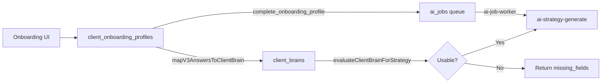

# Client Onboarding and Client Brain Audit

## Audit Date: 2026-01-10

---

## 1. Client Onboarding Profiles Table

### Schema

**Location:** [20251230200000_client_onboarding_v4.sql](supabase/migrations/20251230200000_client_onboarding_v4.sql)

| Column | Type | Purpose |
|--------|------|---------|
| `id` | uuid | Primary key |
| `client_id` | uuid | FK to clients |
| `agency_id` | uuid | FK to agencies |
| `version` | text | Schema version (v4, v5) |
| `v5_meta` | jsonb | V5 structured data |
| `responses` | jsonb | Raw responses |
| `followup_responses` | jsonb | Follow-up answers |
| `ai_scan_result` | jsonb | AI scan output |
| `ai_scan_at` | timestamptz | When scanned |
| `ai_scan_accepted` | boolean | User accepted scan |
| `completed_at` | timestamptz | Completion timestamp |
| `updated_at` | timestamptz | Last update |

### Key V5 Meta Fields

| Field | Type | Purpose |
|-------|------|---------|
| `brand` | string | Brand name |
| `website` | string | Website URL |
| `platforms` | string[] | Social platforms |
| `tone` | string[] | Brand voice/tone |
| `offers` | string[] | Products/services |
| `differentiators` | string[] | Unique selling points |
| `audience` | string[] | Target demographics |
| `competitors` | string[] | Competitor names |
| `goals` | string[] | Business goals |
| `kpis` | string[] | Key metrics |
| `constraints` | string[] | Content restrictions |
| `banned_claims` | string[] | Forbidden claims |
| `taboo_topics` | string[] | Off-limits topics |
| `pillars` | string[] | Content pillars |

---

## 2. Client Brains Table

### Schema

**Location:** [20251223150000_ai_employee_v1_sprint1.sql](supabase/migrations/20251223150000_ai_employee_v1_sprint1.sql)

| Column | Type | Purpose |
|--------|------|---------|
| `id` | uuid | Primary key |
| `client_id` | uuid | FK to clients |
| `agency_id` | uuid | FK to agencies |
| `brain_json` | jsonb | Structured brain data |
| `version` | integer | Brain version number |
| `usable` | boolean | Ready for AI tasks |
| `status` | text | draft/ready/stale |
| `updated_at` | timestamptz | Last update |

### Brain JSON Structure

**Location:** [client-brain-mapping.ts:84-134](supabase/functions/_shared/client-brain-mapping.ts#L84-L134)

```typescript
{
  brand_basics: {
    name: string,
    website: string,
    socials: string[],
    tone: string,
    differentiators: string[],
  },
  offer_details: {
    products_services: string[],
    pricing_optional: string,
    usps: string[],
  },
  audience: {
    demographics: string[],
    location: string[],
    intent: string[],
    problems: string[],
    objections: string[],
  },
  competitors: string[],
  constraints: {
    banned_claims: string[],
    legal_constraints: string[],
    taboo_topics: string[],
    banned_claims_or_taboo_topics: string[],
    dos: string[],
    donts: string[],
  },
  pillars: { name: string, examples: string[] }[],
  client_brief_v1: ClientBriefV1,
  faq: any[],
  assets_links: {
    key_urls: string[],
    guidelines_link: string,
    lead_magnet_optional: string,
  },
  goals: string[],
  metrics: string[],
  timeline: string,
  approvals: string,
  contacts: string[],
  raw_responses: Record<string, unknown>,
  followup_responses: Record<string, unknown>,
  inference_metadata: {
    source: string,
    generated_at: string,
  },
}
```

---

## 3. Onboarding → Brain Mapping

### Mapping Function

**Location:** [client-brain-mapping.ts:35-135](supabase/functions/_shared/client-brain-mapping.ts#L35-L135)

```typescript
export function mapV3AnswersToClientBrain(
  rawResponses: Record<string, unknown>,
  followupResponses: Record<string, unknown> = {},
  generatedAt: string = new Date().toISOString(),
)
```

### Field Mappings

| Onboarding Field | Brain Field | Transformation |
|------------------|-------------|----------------|
| `brand` | `brand_basics.name` | Direct |
| `website` | `brand_basics.website` | Direct |
| `platforms` | `brand_basics.socials` | splitToList |
| `tone` | `brand_basics.tone` | Join array |
| `differentiators` | `brand_basics.differentiators` | splitToList |
| `offers` | `offer_details.products_services` | splitToList |
| `pricing` | `offer_details.pricing_optional` | Direct |
| `audience` | `audience.demographics` + `audience.problems` | splitToList |
| `competitors` | `competitors` | splitToList |
| `constraints` | `constraints.banned_claims` (fallback) | splitToList |
| `banned_claims` | `constraints.banned_claims` | splitToList |
| `taboo_topics` | `constraints.taboo_topics` | splitToList |
| `pillars` | `pillars` | Derived with fallbacks |
| `goals` | `goals` | splitToList |
| `kpis` | `metrics` | splitToList |
| `timeline` | `timeline` | Direct |
| `approval_cadence` | `approvals` | Direct |
| `approver_contact` | `contacts` | splitToList |

### Pillar Fallback Logic

**Location:** [client-brain-mapping.ts:55-69](supabase/functions/_shared/client-brain-mapping.ts#L55-L69)

```typescript
const explicitPillarNames = splitToListNormalized(rawResponses.pillars);
const fallbackPillarNames = uniq([
  ...offersList,
  ...differentiatorsList,
]).slice(0, 6);
const pillarSeed = clampList(explicitPillarNames, 0, 6, fallbackPillarNames);
const pillarNames = ensureMinList(pillarSeed, 3, [
  ...fallbackPillarNames,
  "Education", "Proof", "Stories", "Behind-the-scenes", "Tips", "FAQs",
]).slice(0, 6);
```

**Behavior:** Ensures minimum 3 pillars, max 6, with fallback to generic pillars if needed.

---

## 4. Brain Usability Evaluation

### Strategy Readiness Check

**Location:** [brain-quality.ts](supabase/functions/_shared/brain-quality.ts)

```typescript
export function evaluateClientBrainForStrategy(brain: any): {
  usable: boolean;
  missing_fields: string[];
  questions: string[];
}
```

### Required Fields for Strategy

| Field Path | Required | Fallback Allowed |
|------------|----------|------------------|
| `brand_basics.name` | Yes | No |
| `offer_details.products_services` | Yes | No |
| `audience.demographics` | Yes | No |
| `pillars` (min 1) | Yes | Yes (from offers/differentiators) |

### Strategy Generation Gate

**Location:** [ai-strategy-generate/index.ts:182-196](supabase/functions/ai-strategy-generate/index.ts#L182-L196)

```typescript
const gate = evaluateClientBrainForStrategy((brainRow.brain_json as any) ?? {});

if (!gate.usable || !brainRow.usable) {
  return jsonResponse(buildUnknownResponse(gate), 200, corsHeaders(req));
}
```

---

## 5. Sync Triggers

### Onboarding Completion → Job Queue

**Location:** [20260108152000_ai_jobs_queue.sql:101-150](supabase/migrations/20260108152000_ai_jobs_queue.sql#L101-L150)

```sql
create or replace function public.complete_onboarding_profile(p_client_id uuid)
returns public.client_onboarding_profiles
language plpgsql
security definer
as $$
  -- Mark profile completed
  -- Enqueue seed_strategy job
  insert into public.ai_jobs (
    job_type,
    dedupe_key,
    status
  ) values (
    'seed_strategy',
    'seed_strategy:' || p_client_id::text,
    'pending'
  )
  on conflict (job_type, client_id, dedupe_key) do update...
$$;
```

### Brain Status RPC

**Location:** [20251224121500_get_client_brain_status_rpc.sql](supabase/migrations/20251224121500_get_client_brain_status_rpc.sql)

```sql
create or replace function public.get_client_brain_status(p_client_id uuid)
returns jsonb
```

Returns:
- `usable`: boolean
- `status`: text
- `missing_fields`: text[]
- `last_updated`: timestamp

---

## 6. Data Flow



---

## 7. Identified Mismatches

### Fields in Onboarding NOT in Brain

| Onboarding Field | Present in Brain | Notes |
|------------------|------------------|-------|
| `v5_meta.budget` | No | Not mapped |
| `v5_meta.frequency` | No | Not mapped |
| `v5_meta.campaign_type` | No | Not mapped |

### Strategy Uses Onboarding Directly

**Location:** [ai-strategy-generate/index.ts:207-213](supabase/functions/ai-strategy-generate/index.ts#L207-L213)

```typescript
const { data: onboardingProfile } = await supabase
  .from("client_onboarding_profiles")
  .select("*")
  .eq("client_id", clientId)
  .order("updated_at", { ascending: false })
  .limit(1)
  .maybeSingle();
```

**Finding:** Strategy generation reads BOTH client_brains AND client_onboarding_profiles directly. The onboarding profile is included in the prompt context.

### Implication

- Brain is used for usability gating
- Onboarding profile is used for full context
- Both are included in derived_from_hash for freshness tracking

---

## 8. Audit Findings

### Verified Behaviors

| Behavior | Status | Evidence |
|----------|--------|----------|
| Onboarding maps to brain | PASS | client-brain-mapping.ts |
| Brain usability gating works | PASS | brain-quality.ts + ai-strategy-generate |
| Pillar fallbacks work | PASS | ensureMinList logic |
| Onboarding completion triggers job | PASS | complete_onboarding_profile RPC |
| Both sources used in strategy | PASS | ai-strategy-generate reads both |

### Recommendations

1. **Document unmapped fields:** `budget`, `frequency`, `campaign_type` in onboarding not in brain
2. **Consider brain-only flow:** Strategy generation could rely solely on brain for consistency
3. **Version alignment:** Ensure onboarding version (v4/v5) maps correctly to brain schema
