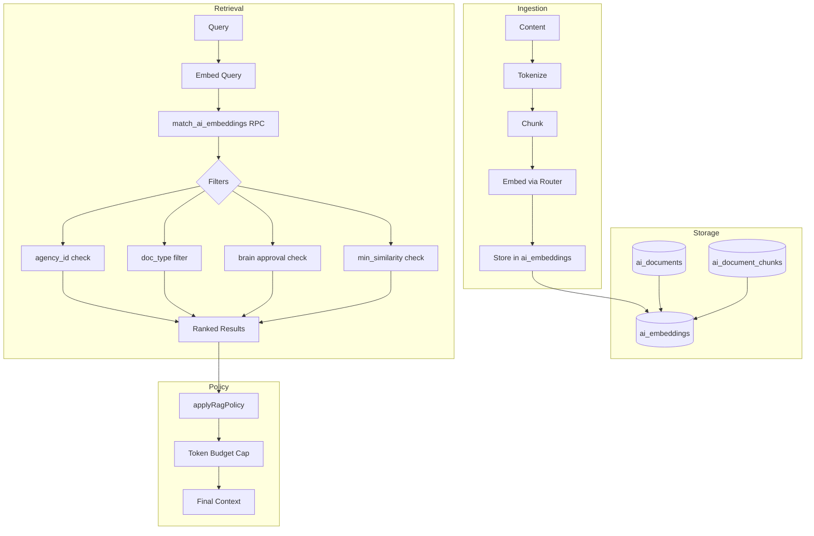

# RAG Pipeline End-to-End Audit

## Audit Date: 2026-01-10

---

## 1. Document Ingestion Pipeline

### Entry Points

| Function | Purpose | Source |
|----------|---------|--------|
| `ai-brain-ingest` | Ingest brain documents | [ai-brain-ingest/index.ts](supabase/functions/ai-brain-ingest/index.ts) |
| `ai-documents-ingest` | Ingest general AI documents | [ai-documents-ingest/index.ts](supabase/functions/ai-documents-ingest/index.ts) |

### Ingestion Flow

```
Content → Tokenize → Chunk → Embed → Store
```

1. **Tokenization:** [embeddings.ts:17-19](supabase/functions/_shared/embeddings.ts#L17-L19)
   ```typescript
   export function tokenize(text: string) {
     return text.trim().split(/\s+/).filter(Boolean);
   }
   ```

2. **Chunking:** [embeddings.ts:21-43](supabase/functions/_shared/embeddings.ts#L21-L43)
   - Default chunk size: 512 tokens
   - Overlap: 64 tokens
   - Max chunks: configurable

3. **Embedding:** [embeddings.ts:45-66](supabase/functions/_shared/embeddings.ts#L45-L66)
   - Routes through `ai.run({ taskType: EMBED_TEXT })`
   - Model: `text-embedding-3-small` (OpenAI)
   - Dimension: 1536

4. **Storage:**
   - `ai_documents` - Document metadata
   - `ai_document_chunks` - Chunk text + status
   - `ai_embeddings` - Vector data

### Document Types

| doc_type | Purpose | Source |
|----------|---------|--------|
| `brain_document` | Agency brain modules | Brain ingest |
| `client_guidelines` | Client-specific guidelines | Document ingest |
| `client_notes` | Client notes | Document ingest |
| `approved_posts` | Approved content examples | Document ingest |
| `agency_sop` | Agency SOPs | Document ingest |
| `agency_exemplar_strategy` | Reference strategies | Document ingest |
| `ai_artifact` | Generated AI content | Document ingest |
| `strategy_draft` | Strategy drafts | Document ingest |

---

## 2. Brain Document Approval Flow

### States

| Status | Meaning | RAG Included |
|--------|---------|--------------|
| `draft` | Not approved | NO |
| `pending_approval` | Awaiting review | NO |
| `approved` | Approved for use | YES |
| `archived` | No longer active | NO |

### Approval Enforcement in RAG

**Location:** [20260108134500_match_ai_embeddings_filters.sql:50](supabase/migrations/20260108134500_match_ai_embeddings_filters.sql#L50)

```sql
and (e.doc_type <> 'brain_document' or (d.metadata->>'status') = 'approved')
```

**Behavior:**
- Brain documents ONLY included if `metadata.status = 'approved'`
- All other doc_types included regardless of metadata

---

## 3. Canonical RAG Store

### Vector Table

**Table:** `ai_embeddings`

| Column | Type | Purpose |
|--------|------|---------|
| `id` | uuid | Primary key |
| `agency_id` | uuid | Tenant isolation |
| `client_id` | uuid | Client scope (nullable) |
| `doc_type` | text | Document classification |
| `document_id` | uuid | FK to ai_documents |
| `chunk_id` | uuid | FK to ai_document_chunks |
| `embedding` | vector(1536) | Embedding vector |
| `model` | text | Embedding model used |
| `metadata` | jsonb | Additional context |

### Indexes

**Location:** [20251223150000_ai_employee_v1_sprint1.sql](supabase/migrations/20251223150000_ai_employee_v1_sprint1.sql)

- IVFFlat index on embedding column for fast similarity search
- B-tree index on `(agency_id, doc_type)` for filtering

---

## 4. Retrieval RPC

### Function Signature

**Location:** [20260108134500_match_ai_embeddings_filters.sql:11-29](supabase/migrations/20260108134500_match_ai_embeddings_filters.sql#L11-L29)

```sql
create or replace function public.match_ai_embeddings(
  p_agency_id uuid,
  p_query_embedding vector(1536),
  p_client_id uuid default null,
  p_match_count int default 8,
  p_doc_types text[] default null,
  p_modules text[] default null,
  p_min_similarity float8 default 0.2
)
```

### Filters Applied

| Filter | SQL Condition | Purpose |
|--------|---------------|---------|
| Agency | `d.agency_id = p_agency_id` | Tenant isolation |
| Chunk status | `c.embedding_status = 'ok'` | Exclude failed embeddings |
| Client scope | `d.client_id = p_client_id` (if provided) | Client-specific docs |
| Doc types | `e.doc_type = any(p_doc_types)` | Filter by document type |
| Module filter | `d.metadata->>'module' = any(p_modules)` | Filter by module |
| Brain approval | `d.metadata->>'status' = 'approved'` (for brain_document) | Only approved brain docs |
| Similarity | `score >= p_min_similarity` | Quality threshold |

### Caps and Limits

| Cap | Value | Enforcement |
|-----|-------|-------------|
| Match count | `least(p_match_count, 12)` | Hard cap at 12 |
| Min similarity | `p_min_similarity` (default 0.2) | Filter in WHERE clause |

**Source:** [retrieval.ts:1](supabase/functions/_shared/retrieval.ts#L1)
```typescript
export const MAX_MATCH_COUNT = 12;
```

---

## 5. RAG Policy Configuration

### Per-Task Config

**Location:** [ragPolicy.ts:34-58](src/ai/ragPolicy.ts#L34-L58)

| TaskType | Client top_k | Agency top_k | Exemplar top_k | Max tokens |
|----------|--------------|--------------|----------------|------------|
| `CLIENT_PORTAL_QA` | 6 | 4 | 2 | 900 |
| `STRATEGY_PLAN` | 6 | 4 | 2 | 1200 |

### Doc Types by Category

**STRATEGY_PLAN:**
- Client: `client_guidelines`, `client_notes`, `approved_posts`, `ai_artifact`, `strategy_draft`
- Agency: `agency_sop`, `brain_document`
- Exemplar: `agency_exemplar_strategy`

### Policy Application

**Location:** [ragPolicy.ts:94-134](src/ai/ragPolicy.ts#L94-L134)

```typescript
export function applyRagPolicy(matches: RagMatch[], config: RagConfig): RagPolicyResult {
  const clientMatches = matches.filter((m) => config.client_doc_types.includes(m.doc_type));
  const agencyMatches = matches.filter((m) => config.agency_doc_types.includes(m.doc_type));
  const exemplarMatches = matches.filter((m) => config.exemplar_doc_types.includes(m.doc_type));

  const preSelected = [
    ...selectTop(clientMatches, config.client_memory_top_k),
    ...selectTop(agencyMatches, config.agency_memory_top_k),
    ...selectTop(exemplarMatches, config.exemplar_top_k),
  ];
  // ... token budget enforcement
}
```

### Rollout Control

**Environment Variable:** `AI_RAG_CENTRALIZED`

| Value | Behavior |
|-------|----------|
| `true` | Always use new policy |
| `false` or unset | Always use legacy |
| `1-99` | Percentage rollout (hash-based) |

**Source:** [ragPolicy.ts:144-159](src/ai/ragPolicy.ts#L144-L159)

---

## 6. Strategy Generation Retrieval

### Retrieval Calls

**Location:** [ai-strategy-generate/index.ts:273-307](supabase/functions/ai-strategy-generate/index.ts#L273-L307)

```typescript
// Client documents
const { data: clientMatches } = await supabase.rpc("match_ai_embeddings", {
  p_agency_id: agencyId,
  p_client_id: clientId,
  p_query_embedding: queryEmbedding,
  p_match_count: clampMatchCount(useRagPolicy ? ragConfig.client_memory_top_k : 6),
  p_doc_types: useRagPolicy ? ragConfig.client_doc_types : legacyClientDocTypes,
  p_min_similarity: useRagPolicy ? ragConfig.min_similarity : 0.2,
});

// Agency documents
const { data: agencyMatches } = await supabase.rpc("match_ai_embeddings", {
  p_agency_id: agencyId,
  p_client_id: null,  // Agency-wide
  p_query_embedding: queryEmbedding,
  ...
});

// Exemplar documents
const { data: exemplarMatches } = await supabase.rpc("match_ai_embeddings", {
  ...
  p_doc_types: useRagPolicy ? ragConfig.exemplar_doc_types : legacyExemplarDocTypes,
});
```

### Token Budget Enforcement

**Location:** [ai-strategy-generate/index.ts:331-339](supabase/functions/ai-strategy-generate/index.ts#L331-L339)

```typescript
const legacyMatches = useRagPolicy ? matches : capMatchesByTokenBudget(matches, 1200).matches;
const fullContext = legacyMatches.map((row) => `(${row.doc_type}) ${row.chunk_text}`).join("\n\n");
const legacyContext = truncate(fullContext, 6000);
```

---

## 7. Test Coverage

| Test File | Tests | Focus |
|-----------|-------|-------|
| [retrieval.test.ts](supabase/functions/_shared/__tests__/retrieval.test.ts) | 3+ | Token capping, match clamping |
| [rag-correctness.test.ts](tests/integration/ai/rag-correctness.test.ts) | 3 | End-to-end RAG correctness |
| [brain-document-rag-filter.test.ts](tests/integration/ai/brain-document-rag-filter.test.ts) | 1 | Approval filter enforcement |
| [match-embedding-filters.test.ts](tests/integration/ai/match-embedding-filters.test.ts) | 1 | SQL function filters |
| [ragPolicy.test.ts](src/ai/ragPolicy.test.ts) | varies | Policy application logic |

---

## 8. Verified Invariants

| Invariant | Status | Evidence |
|-----------|--------|----------|
| Brain docs only if approved | PASS | SQL filter line 50 |
| Chunk status = ok required | PASS | SQL filter line 46 |
| Agency isolation enforced | PASS | SQL filter line 45 |
| Match count capped at 12 | PASS | SQL line 53 + retrieval.ts:1 |
| Token budget respected | PASS | ragPolicy.ts + strategy-generate |
| Min similarity enforced | PASS | SQL filter line 51 |

---

## 9. Data Flow Diagram


