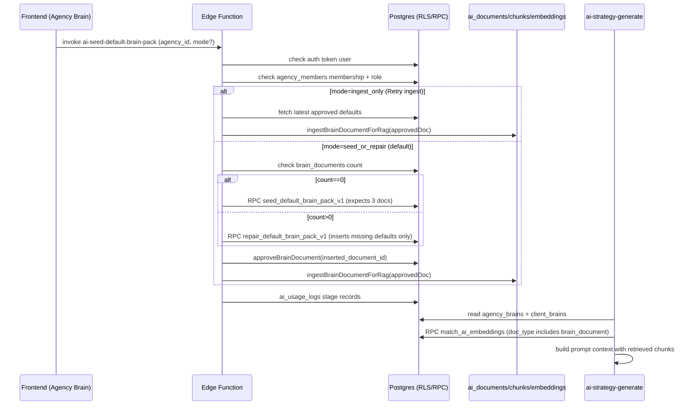

# Default Brain Pack v1 — Architecture (End-to-End)

## Build/Quality Gate (this audit run)

- Tests: `npm test` (pass) (tool output, 2026-01-16).
- Lint: `npm run lint` (pass) (tool output, 2026-01-16).
- Build: `npm run build` (pass; warnings only) (tool output, 2026-01-16).
- Typecheck: `npx tsc -p tsconfig.json --noEmit` (pass) (tool output, 2026-01-16).

## The Two “Brains” (critical naming collision)

1) **`agency_brains` / `client_brains` (structured JSON brains)**  
   - Strategy generation reads them directly: `supabase/functions/ai-strategy-generate/index.ts:169` (client brain) and `supabase/functions/ai-strategy-generate/index.ts:199` (agency brain).
   - CreateAgency onboarding writes/locks/ingests these brains: `src/pages/CreateAgencyStub.tsx:224` and `src/pages/CreateAgencyStub.tsx:229`.

2) **`brain_documents` (module docs shown in “Agency Brain” UI)**  
   - UI routes: `src/App.tsx:245` and `src/App.tsx:246`.
   - UI fetches `brain_documents` per agency: `src/hooks/useBrainDocuments.ts:24`.
   - These become RAG inputs via ingestion to `ai_documents`/`ai_document_chunks`/`ai_embeddings`: `supabase/functions/_shared/brain-documents.ts:663`.

**Risk:** the product calls both “Agency Brain”, but strategy generation primarily uses `agency_brains` + RAG context (which may include ingested `brain_documents`). This is a major source of “looks configured but AI doesn’t use it” confusion.

## Default Brain Pack v1: Source of Truth

- Template + placeholder renderer: `supabase/functions/_shared/defaultBrainPackV1.ts:97` and `supabase/functions/_shared/defaultBrainPackV1.ts:93`.
- Exactly 3 modules: `bootstrap`, `rep_policy`, `quality_bar`: `supabase/functions/_shared/defaultBrainPackV1.ts:99`, `supabase/functions/_shared/defaultBrainPackV1.ts:117`, `supabase/functions/_shared/defaultBrainPackV1.ts:157`.
- Frontend imports the same source (no drift): `src/brain/defaultPackV1.ts:1`.

## Seed/Repair → Approve → Ingest → Retrieve → Strategy (sequence)

Evidence for each step:
- Edge auth: `supabase/functions/ai-seed-default-brain-pack/index.ts:33`.
- Edge role gate (owner/admin): `supabase/functions/ai-seed-default-brain-pack/index.ts:77`.
- Seed vs repair decision: `supabase/functions/ai-seed-default-brain-pack/index.ts:103`.
- Seed RPC: `supabase/migrations/20260110120000_seed_default_brain_pack_v1_rpc.sql:7`.
- Repair RPC: `supabase/migrations/20260116210000_repair_default_brain_pack_v1_rpc.sql:8`.
- Approve+ingest (inserted docs): `supabase/functions/_shared/seed-default-brain-pack.ts:268`.
- Ingest-only (retry): `supabase/functions/_shared/seed-default-brain-pack.ts:113`.
- Stage logging payload: `supabase/functions/_shared/default-brain-pack-usage-log.ts:47`.
- Strategy retrieval uses `match_ai_embeddings`: `supabase/functions/ai-strategy-generate/index.ts:283`.

## Truth Table (UI vs AI)

| Concern | UI Source of Truth | AI Source of Truth | Notes |
|---|---|---|---|
| Module configured/approved state | `brain_documents` via `useDocumentsByModule` (`src/hooks/useBrainDocuments.ts:307`) | RAG retrieval of `ai_documents` `doc_type='brain_document'` (`supabase/migrations/20260108134500_match_ai_embeddings_filters.sql:42`) | Strategy does **not** read `brain_documents` directly. |
| “Agency Brain” JSON used in strategy prompt | Not shown on Agency Brain UI (separate system) | `agency_brains.brain_json` (`supabase/functions/ai-strategy-generate/index.ts:199`) | Naming collision. |
| Default Brain Pack create/repair | CTA shows when any default module missing (`src/pages/agency/BrainLayerDetail.tsx:107`) | Edge routes seed vs repair by total docs (`supabase/functions/ai-seed-default-brain-pack/index.ts:103`) | Repair inserts only missing defaults (`supabase/migrations/20260116210000_repair_default_brain_pack_v1_rpc.sql:8`). |
| Ingestion health + retry | Banner shown when approved defaults missing in RAG (`src/pages/agency/BrainLayerDetail.tsx:415`) | Ingest-only mode re-indexes approved defaults (`supabase/functions/ai-seed-default-brain-pack/index.ts:104`) | Retry does not create docs. |
| Approval | “Set Live” calls edge approve (`src/pages/agency/BrainLayerDetail.tsx:576`) | `approveBrainDocument` updates `brain_documents.status='approved'` (`supabase/functions/_shared/brain-documents.ts:346`) | Edge approve role-gated: `supabase/functions/_shared/ai-brain-document-approve-handler.ts:55`. |
