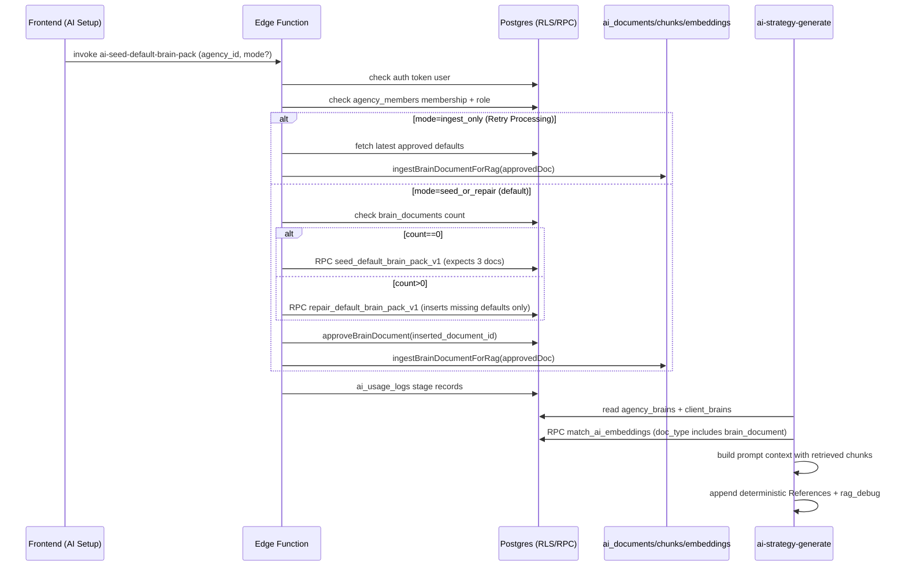

# Default Brain Pack v1 — Architecture (End-to-End, post AI Setup redesign)

## The Two “Brains” (critical naming collision)

1) **`agency_brains` / `client_brains` (structured JSON brains)**
   - Strategy generation reads them directly: `supabase/functions/ai-strategy-generate/index.ts`
   - Agency onboarding writes/locks/ingests these brains: `src/pages/CreateAgencyStub.tsx`

2) **`brain_documents` (module docs shown in AI Setup UI)**
   - UI routes:
     - `/agency/ai-setup` → `src/pages/agency/AISetup.tsx`
     - `/agency/ai-setup/:moduleKey` → `src/pages/agency/ModuleDetail.tsx`
   - UI fetches `brain_documents` for active agency: `src/hooks/useBrainDocuments.ts`
   - These become RAG inputs via ingestion to `ai_documents`/`ai_document_chunks`/`ai_embeddings`: `supabase/functions/_shared/brain-documents.ts`

**Risk:** Users may assume editing module docs changes the strategy “brain JSON” directly. It doesn’t. Module docs only affect AI output if ingestion succeeds and retrieval includes those chunks.

## Default Brain Pack v1: Source of Truth

- Template + placeholder renderer: `supabase/functions/_shared/defaultBrainPackV1.ts`
- Exactly 3 default modules: `bootstrap`, `rep_policy`, `quality_bar`
- Frontend uses the same template source for examples where appropriate: `src/lib/brain/examples.ts`

## Seed/Repair → Approve → Ingest → Retrieve → Strategy (sequence)

## Truth Table (UI vs AI)

| Concern | UI Source of Truth | AI Source of Truth | Notes |
|---|---|---|---|
| Module draft/active state | `brain_documents` via `useBrainDocuments` / `useDocumentsByModule` | Retrieval of `ai_documents` + chunks + embeddings | Strategy does **not** read `brain_documents` directly. |
| “Agency Brain” JSON used in strategy prompt | Not shown in AI Setup UI | `agency_brains.brain_json` | Naming collision (separate system). |
| Default Brain Pack create/repair | Quick Setup (`mode=seed_or_repair`) | Edge chooses seed vs repair, DB RPCs enforce idempotency | Repair inserts only missing defaults. |
| Ingestion health + retry | Display status uses `useDefaultBrainPackIngestionHealth` | `mode=ingest_only` reindexes approved defaults | Retry does not create docs. |
| Activation | “Activate” calls approve edge function | Approve updates `brain_documents.status='approved'` then ingests | Role-gated at edge (owner/admin). |

